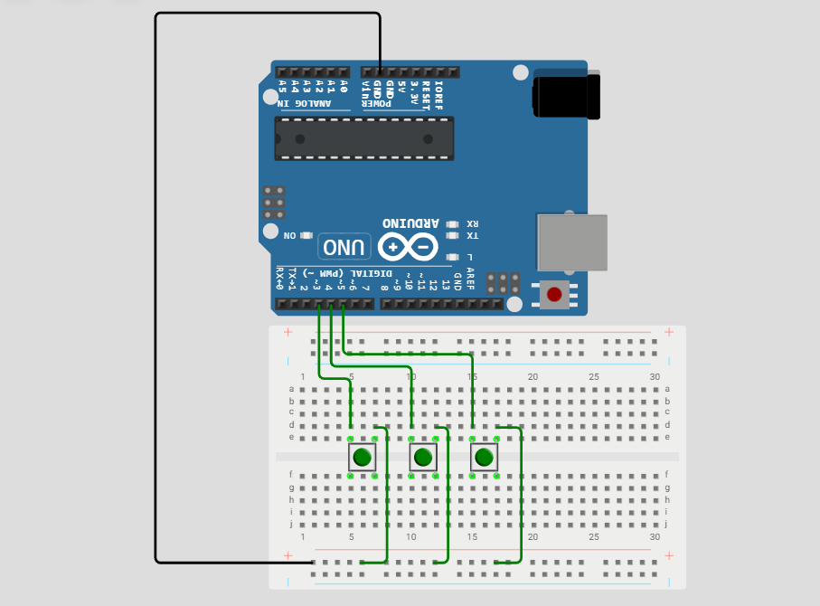
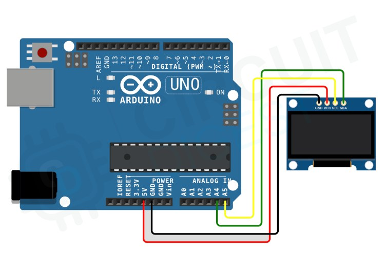

# Basis

RF Jammer that seeks to disrupt 2.4 GHz to 2.525 GHz frequency range; through the constant maximum-throughput of two nRF24L01+PA+LNA modules, the device rapidly transmits a continuous carrier to randomized frequencies on the 2.4-2.525 GHz ISM band.

# Showcase

> Final product image

> OLED GUI + interaction between transmission and Spectrum Analyzer showcase

> Sucessful jamming of RF-dependent device

# Components

*I sourced the Arduino Uno, Pushbuttons, and wires from an [ELEGOO UNO R3 Project Super Starter Kit](https://www.amazon.com/EL-KIT-001-Project-Complete-Starter-Tutorial/dp/B01CZTLHGE/ref=as_li_ss_tl?keywords=elegoo+super+starter+kit&qid=1582663388&sr=8-3&linkCode=sl1&tag=sonofthesouth-20&linkId=242e768d54e634daf31fdd05288857bc&language=en_US); the nRF24L01 modules and I2C OLED were obtained from both Amazon and Aliexpress respectively.*

+ Arduino of any kind (I used an uno) (x1)

+ [nRF24l01 + PA + LNA](https://www.amazon.com/HiLetgo%C2%AE-NRF24L01-Wireless-Transceiver-Compatible/dp/B00WG9HO6Q/ref=sr_1_1_sspa?crid=1TA8RJJREXNDZ&dib=eyJ2IjoiMSJ9.w_3O-fh_msuI0EpJVsmw2PJG6gaPWPhhWytxuKPfcVGXbvGktaJ49_sw0CY0QWgSR3O3EZDtxy-VqUdP_9GHMxFN6p_pHPHNLOIhsOsyrO3J5Qp_DMTnFcvHjUSxGItHDgFf-qCk_yS1S-ogB0D74l0go2N3K1pgdkhuSBqCFW5tm7_SmDS85M1K_2g5gz8Ay13oOO2ZZF1nzJGRqwHDCYKmbMD2S8TpSWmebTPqTRA.ooLUK7jaEZcWiH_9J6I6co-7VMYTJenm6_o4H5cPSi4&dib_tag=se&keywords=nRF24l01&qid=1783614760&sprefix=nrf24l01%2Caps%2C154&sr=8-1-spons&sp_csd=d2lkZ2V0TmFtZT1zcF9hdGY&th=1) (x2) **Important:** You will need to solder 10 uF capicators to each module

+ Pushbuttons (x3)

+ 0.96 inch I2C OLED (x1)

+ Some male-male and male-female wires

# Replication Directions

## 1. Schematic

I used the following diagrams to hookup the core components, using 3.3V/GND rails in order to reduce the complexity of the circuit. Ultimately the arrangement of this device's wiring is up to your creativity.

***Important*** 

Make sure **both** nRF24's share the same connection to MOSI, IRQ, SCK and MISO. Alternatively, make sure each module's CSN and CE pins are connected to differing digital pins on your Arduino. To match with the software, one module should be designated pins 9 and 8CE, CSN and the other should be assigned 7 and 6CE, CSN

## 2. Code

Once all components are wired correctly, all you need to do is upload "Wifi_Jammer.ino" onto your Arduino to replicate this project's software sucessfully.
